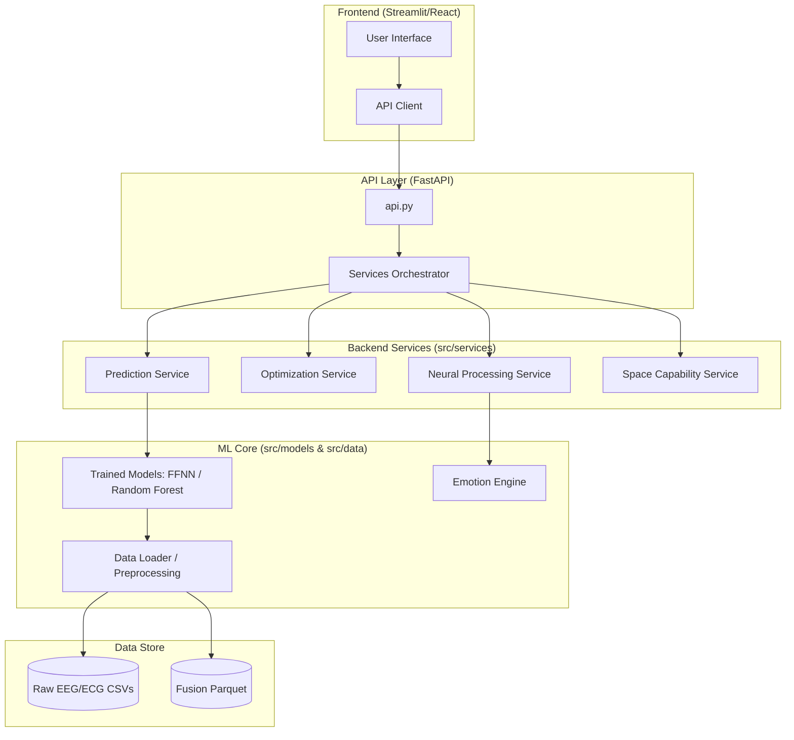

# Project Report: Predictive Atmospheres - Mark 3

## 1. Executive Summary
**Predictive Atmospheres** is a neuro-architectural design platform. It leverages machine learning to infer human emotional states (Valence and Arousal) from architectural spatial features. The system employs a **multimodal affective fusion** approach, combining objective biometric data (EEG and ECG) with subjective self-reported scores to create a high-fidelity ground-truth for model training.

The platform is designed as a decoupled system with a headless ML backend and a modern web-based frontend, allowing architects and researchers to predict how spatial modifications influence human emotion.

---

## 2. System Architecture

### 2.1 High-Level Component Diagram

### 2.2 Structural Breakdown
| Component | Path | Responsibility |
| :--- | :--- | :--- |
| **API Entry** | `api.py` | FastAPI endpoints; bridges frontend requests to backend logic. |
| **ML Backend** | `src/` | Core logic: data processing, model training, and inference. |
| **Frontend** | `frontend/` | Streamlit application for design studio and emotion visualization. |
| **Data** | `data/` | Raw biometric files, metadata, and processed fusion tensors. |
| **Configuration** | `src/config.py` | Centralized dataclasses for EEG, Model, Training, and Fusion params. |

---

## 3. Technical Deep Dive

### 3.1 Multimodal Affective Fusion
The core innovation is the fusion of objective and subjective data to define the target emotional state:

**Fusion Formula:**
$$\text{Target} = \alpha \cdot \text{Objective} + (1 - \alpha) \cdot \text{Subjective}$$

*   **Objective Sources:**
    *   **Valence:** Derived from Frontal Alpha Asymmetry (FAA) in EEG.
    *   **Arousal:** Derived from RMSSD (Root Mean Square of Successive Differences) in ECG.
*   **Subjective Sources:** User-reported Valence and Arousal scores.
*   **$\alpha$ (Fusion Weight):** Configurable (default 0.6), balancing biometric trust vs. self-reporting.

### 3.2 Spatial Input Schema
The model uses 12 independent variables to predict emotional outcomes:

| Category | Features | Examples |
| :--- | :--- | :--- |
| **Geometry** | 4 | Length, Width, Height, Walkable Floor Area |
| **Openings** | 4 | Num Doors, Door Area, Num Windows, Window Area |
| **Daylight** | 4 | Daylight Factor, Illuminance, CCT |
| **Categorical**| 1 | Space Type (Bedroom, Office, etc.) |

**Derived Features:** The backend automatically computes ratios (e.g., Length/Width, Window Area/Wall Area) to enhance model performance.

### 3.3 Model Architectures
The system supports multiple model types via `src/models/architectures.py`:
1.  **PyTorch FFNN:** A deep Feed-Forward Neural Network with residual connections and batch normalization.
2.  **Random Forest:** A robust scikit-learn baseline for non-linear spatial relationships.
3.  **Cognitive Bridge:** Maps predictions into a Valence-Arousal (V-A) space using MDS (Multidimensional Scaling) coordinates.

---

## 4. Data Pipeline & Workflow

### 4.1 Pipeline Flow
`Raw Data` $\rightarrow$ `Preprocessing (Butterworth/Welch)` $\rightarrow$ `Affective Fusion` $\rightarrow$ `Model Training` $\rightarrow$ `Inference API` $\rightarrow$ `Frontend Visualization`

### 4.2 Deployment Stack
*   **Backend:** FastAPI, PyTorch, Scikit-Learn, Pandas.
*   **Frontend:** Streamlit (originally React/Vite hinted in README).
*   **Infrastructure:** Dockerized deployment with `Dockerfile` and `Dockerfile.api`.

---

## 5. Summary Table: Key Configurations

| Parameter | Default | Location | Impact |
| :--- | :--- | :--- | :--- |
| `fusion.alpha` | $0.6$ | `FusionConfig` | Balance of EEG/ECG vs. Self-Report |
| `training.epochs`| $300$ | `TrainingConfig` | Neural network convergence |
| `eeg.sample_rate` | $256\text{Hz}$ | `EEGConfig` | Signal processing fidelity |
| `model.type` | Random Forest| `ModelConfig` | Predictive logic architecture |
| `faa_scalar` | $10.0$ | `EmotionConfig` | Variance stretch for objective valence |

---
*Report generated on 2026-10-08*
